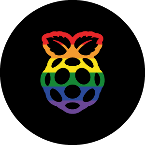

<table align="center">
  <tr>
    <td>
      
    </td>
    <td>
      <h2> Raspberry Discord Bot </h2>
    </td>
  </tr>
</table>

Welcome to **Raspberry** - a modular Discord bot built as a fun hobby project!  
This bot is completely open-source to promote transparency and inspire others to create their own bots.

This is a simple Discord reaction bot, developed primarily for the purpose of learning how to host applications on a Raspberry Pi.

**This code is free to use.**  
**Currently Running on a Rasberry Pi**  
**Created by Evilsaint1022 (Owner, Developer)**  

